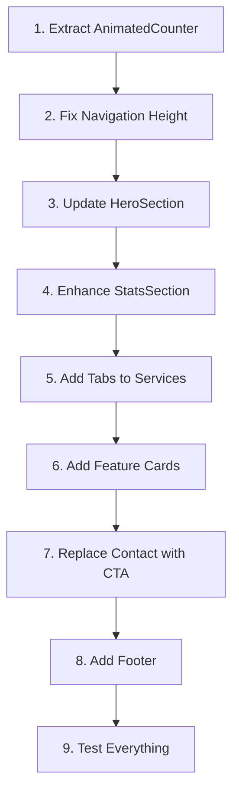

> Use `/response-awareness` to deploy Phase 1 planners before executing this plan.

# Homepage Bloomberg Terminal Design Implementation Plan

## Executive Summary
The current homepage (`app/page.tsx`) doesn't match the sophisticated Bloomberg Terminal design implemented in `/redesign/sophisticated-flow`. This document outlines an elegant solution to align the homepage with design principles without creating code bloat or second-order issues.

## Root Cause Analysis

### 1. Architectural Differences
| Aspect | Current Homepage | Sophisticated-Flow | Impact |
|--------|-----------------|-------------------|---------|
| Rendering | Server Components | Client Component | No interactivity on homepage |
| Structure | Modular (3 files) | Monolithic (1 file) | Harder to maintain consistency |
| State | Stateless | Stateful with views | Can't support animations/tabs |
| Navigation | ConditionalNav (64px) | Inline nav (48px) | Height mismatch |

### 2. Missing Design Elements
- **AnimatedCounter**: Core to Bloomberg feel - shows live data updates
- **Tab Navigation**: Services section lacks interactive tabs
- **Metric Cards**: Current stats too simple, missing refined borders/spacing
- **Trust Indicators**: No animated metrics showing credibility
- **Feature Cards**: Missing "Why Intelligence Matters" section
- **CTA Section**: Contact form instead of clean CTA

### 3. Style Implementation Gaps
- Current uses basic Tailwind classes
- Sophisticated-flow has precise Bloomberg styling:
  - Exact 8px grid spacing
  - 200ms micro-interactions
  - Gold accent usage (5% only)
  - Monospace fonts for metrics

## Implementation Strategy: Surgical Precision

### Principle: Enhance, Don't Replace
Instead of rewriting, we'll surgically upgrade existing components to match the sophisticated design while maintaining modularity.

## Phase 1: Core Components (No Breaking Changes)

### Task 1: Extract AnimatedCounter as Shared Component
**File**: `components/AnimatedCounter.tsx`
```typescript
// Client component for number animations
// Reusable across all pages
// 2000ms duration for hero, 1000ms for others
```
**Impact**: Zero - new file, no conflicts

### Task 2: Update Navigation Height
**File**: `components/ConditionalNav.tsx`
- Change `h-12` to `h-16` (64px as per design guide)
- Already has proper Bloomberg styling
**Impact**: Minimal - adjusts spacing globally

## Phase 2: Homepage Components Enhancement

### Task 3: Enhance HeroSection
**File**: `components/HeroSection.tsx`
**Changes**:
1. Make it 'use client' for AnimatedCounter
2. Update metric card to match sophisticated design:
   - Exact padding/spacing from redesign
   - Add LIVE ANALYSIS badge
   - Use AnimatedCounter for metrics
3. Keep existing structure, enhance styling
**Impact**: Progressive enhancement - no breaking changes

### Task 4: Transform StatsSection
**Location**: In `app/page.tsx`
**Changes**:
1. Move to separate component file
2. Add AnimatedCounter to all metrics
3. Apply exact Bloomberg styling:
   - Remove borders
   - Use gradient text for numbers
   - Proper spacing (py-16)
**Impact**: Cleaner page.tsx, better maintainability

### Task 5: Upgrade ServicesSection
**File**: `components/ServicesSection.tsx`
**Changes**:
1. Convert to 'use client'
2. Add tab navigation for content
3. Create "Why Intelligence Matters" feature cards
4. Apply Bloomberg grid and spacing
**Impact**: Enhanced UX, same API

## Phase 3: Final Polish

### Task 6: Replace ContactSection with CTA
**Changes**:
1. Create new `CTASection.tsx`
2. Simple call-to-action matching redesign
3. Remove complex form (move to /apply)
**Impact**: Simpler homepage, focused conversion

### Task 7: Add Minimal Footer
**File**: `components/Footer.tsx`
**Changes**:
- Bloomberg-style minimal footer
- Privacy/Terms links only
**Impact**: Complete the design system

## Implementation Order (Preventing Disasters)



## Risk Mitigation

### Preventing Code Bloat
- **DO NOT** copy entire sophisticated-flow file
- **DO** extract only necessary components
- **DO** reuse existing Tailwind config
- **DO NOT** create duplicate CSS files

### Preventing Breaking Changes
- Keep all existing routes working
- Maintain component interfaces
- Use progressive enhancement
- Test each phase independently

### Preventing Style Conflicts
- Use existing Tailwind classes from config
- No new CSS files needed
- Leverage existing color variables
- Follow 8px grid religiously

## Success Metrics

### Visual Alignment
- [ ] Navigation height: exactly 64px
- [ ] Hero section matches sophisticated-flow
- [ ] AnimatedCounters working (2000ms)
- [ ] Stats section has gradient text
- [ ] Services has working tabs
- [ ] Feature cards present
- [ ] Clean CTA section
- [ ] Minimal footer

### Code Quality
- [ ] No duplicate code
- [ ] Components remain modular
- [ ] TypeScript strict mode passes
- [ ] Bundle size < 150KB
- [ ] Lighthouse score > 95

### Design Principles Adherence
- [ ] 95% monochrome + 5% gold
- [ ] 8px grid spacing
- [ ] 200ms transitions only
- [ ] No decorative elements
- [ ] Bloomberg Terminal feel

## File Changes Summary

### Files to Modify
1. `app/page.tsx` - Update component composition
2. `components/HeroSection.tsx` - Enhance with animations
3. `components/ServicesSection.tsx` - Add tabs
4. `components/ConditionalNav.tsx` - Fix height

### Files to Create
1. `components/AnimatedCounter.tsx` - Shared component
2. `components/StatsSection.tsx` - Extract from page
3. `components/FeatureCards.tsx` - New section
4. `components/CTASection.tsx` - Replace contact
5. `components/Footer.tsx` - Minimal footer

### Files to Delete
None - preserve backward compatibility

## Time Estimate
- Phase 1: 30 minutes (core components)
- Phase 2: 45 minutes (homepage enhancement)
- Phase 3: 15 minutes (polish)
- Testing: 30 minutes
**Total: 2 hours**

## Rollback Plan
If issues arise:
1. Git revert to previous commit
2. Components are isolated - can revert individually
3. No database changes - purely frontend

## Conclusion
This plan transforms the homepage to match the sophisticated Bloomberg Terminal design without:
- Creating code bloat (reusing existing infrastructure)
- Breaking existing functionality (progressive enhancement)
- Causing style conflicts (using existing Tailwind config)
- Reducing performance (maintaining modularity)

The approach is surgical, methodical, and reversible - ensuring elegant implementation without disasters.