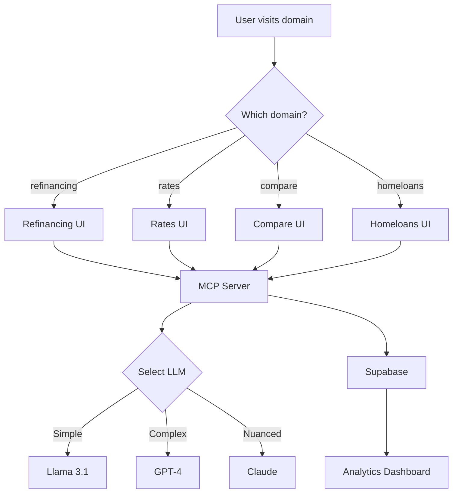

> Feed this backlog item into `/response-awareness` before implementation.

# MCP Mortgage Brain - Roundtable Session
## Side Project: Multi-Domain AI Mortgage Advisory Platform

### **SESSION TYPE**: Architecture & Domain Strategy
### **DATE**: 2025-08-28
### **PROJECT**: Personal Mortgage Brain as a Service

---

## **ROUNDTABLE ASSEMBLY**

### **Lead: Raj (AI/ML Engineer)**
"This is perfect for MCP architecture. We can build once, deploy everywhere. Each domain becomes a different personality of the same brain."

### **Marcus (Lead Architect)**
"MCP gives us true separation of concerns. The brain logic stays consistent while interfaces adapt."

### **Kelly (DevOps Engineer)**
"With these premium domains, we can A/B test different positioning while using the same backend."

### **Sarah (Frontend Engineer)**
"Each domain can have its own UI personality but share the underlying intelligence."

### **Jason (Data Engineer)**
"One data lake, multiple entry points. This multiplies our lead capture surface area."

### **Emily (Technical Coordinator)**
"Let's evaluate which domain best fits which strategy."

---

## **DOMAIN STRATEGY ANALYSIS**

### **Available Domains Evaluation:**

| Domain | Best Use Case | Target Audience | Positioning | SEO Potential |
|--------|--------------|-----------------|-------------|---------------|
| **refinancing.com.sg** | 🏆 **WINNER** | Existing homeowners | "Singapore's Smart Refinancing Brain" | Highest - Direct intent |
| **rates.com.sg** | Rate comparison | Rate shoppers | "Real-time Rate Intelligence" | High - Broad searches |
| **compare.com.sg** | Aggregator play | Researchers | "Compare Everything Mortgage" | Medium - Competitive |
| **homeloans.com.sg** | New buyers | First-timers | "Your First Home Loan Guide" | High - Specific intent |

### **Raj's Recommendation:**
> "Start with **refinancing.com.sg** - it's the most focused, highest intent, and perfect for our tollbooth strategy. People refinancing have immediate need and existing loans to optimize."

### **Marcus's Architecture Vision:**
> "Each domain becomes a different 'mode' of the same MCP server:
> - refinancing.com.sg → Refinancing specialist
> - rates.com.sg → Rate tracker
> - compare.com.sg → Comparison engine
> - homeloans.com.sg → New buyer guide"

---

## **MCP ARCHITECTURE DESIGN**

### **Core MCP Server Structure:**

```javascript
// mcp-mortgage-brain/server.js
{
  "name": "mortgage-brain-mcp",
  "version": "1.0.0",
  
  "personalities": {
    "refinancing": {
      "domain": "refinancing.com.sg",
      "focus": "Refinancing optimization",
      "primaryTriggers": ["loss_aversion", "urgency"],
      "systemPrompt": "You are Singapore's refinancing specialist. Focus on lock-in periods, rate savings, and timing optimization."
    },
    "rates": {
      "domain": "rates.com.sg", 
      "focus": "Rate tracking and alerts",
      "primaryTriggers": ["scarcity", "social_proof"],
      "systemPrompt": "You track every bank's rates in real-time. Highlight rate movements and windows of opportunity."
    },
    "compare": {
      "domain": "compare.com.sg",
      "focus": "Comprehensive comparison",
      "primaryTriggers": ["authority", "completeness"],
      "systemPrompt": "You compare all aspects: rates, fees, features, flexibility. Be the most thorough comparison tool."
    },
    "homeloans": {
      "domain": "homeloans.com.sg",
      "focus": "First-time buyer education",
      "primaryTriggers": ["trust", "guidance"],
      "systemPrompt": "You guide first-time buyers through the entire journey. Be educational and supportive."
    }
  }
}
```

### **Sarah's UI Strategy:**

```typescript
// Each domain gets unique UI personality
const domainThemes = {
  'refinancing.com.sg': {
    hero: "Save Thousands on Your Existing Loan",
    color: "#E74C3C", // Urgent red
    emotion: "urgency",
    cta: "Check My Savings Now"
  },
  'rates.com.sg': {
    hero: "Live Rates from 16 Banks",
    color: "#3498DB", // Trust blue
    emotion: "authority",
    cta: "Track Rates Live"
  },
  'compare.com.sg': {
    hero: "Compare Everything, Choose Wisely",
    color: "#27AE60", // Balanced green
    emotion: "confidence",
    cta: "Start Comparing"
  },
  'homeloans.com.sg': {
    hero: "Your First Home Loan, Simplified",
    color: "#9B59B6", // Friendly purple
    emotion: "support",
    cta: "Get Started"
  }
}
```

---

## **IMPLEMENTATION PLAN**

### **Phase 1: MCP Server Development (Week 1)**

#### **Day 1-2: Core MCP Server**
```bash
# Project structure
mcp-mortgage-brain/
├── server/
│   ├── index.ts          # MCP server entry
│   ├── tools/            # Analysis tools
│   ├── resources/        # Bank data, rates
│   └── personalities/    # Domain-specific prompts
├── shared/
│   ├── calculations/     # Mortgage math
│   ├── psychology/       # Dr. Elena's triggers
│   └── tollbooth/       # Value gating logic
└── config/
    └── domains.json      # Domain configurations
```

#### **Day 3-4: Tool Implementation**
```typescript
// tools/analyze.ts
export const analyzeTool = {
  name: 'analyze_mortgage',
  description: 'Analyze mortgage profile with psychological insights',
  
  inputSchema: {
    profile: 'object',
    domain: 'string', // Which personality to use
    gate: 'number'    // Tollbooth level
  },
  
  async execute(inputs) {
    const personality = getPersonality(inputs.domain)
    const insights = await generateInsights(inputs.profile, personality)
    return applyTollbooth(insights, inputs.gate)
  }
}
```

#### **Day 5: Testing & Integration**
- Test with Claude Desktop
- Test with GPT-4 via API
- Test with local Llama

---

### **Phase 2: Web Application (Week 2)**

#### **Kelly's Deployment Architecture:**
```yaml
# Infrastructure as Code
services:
  mcp-server:
    platform: Railway
    cost: $5/month
    endpoints:
      - wss://mcp.yourdomain.com
  
  web-apps:
    platform: Vercel
    cost: Free tier
    domains:
      - refinancing.com.sg
      - rates.com.sg
      - compare.com.sg  
      - homeloans.com.sg
  
  database:
    platform: Supabase
    cost: Free tier
    purpose: Lead storage, analytics
```

#### **Jason's Data Flow:**


---

### **Phase 3: LLM Strategy (Week 3)**

#### **Raj's Multi-LLM Architecture:**

```typescript
// llm-router.ts
export class LLMRouter {
  async route(request: AnalysisRequest) {
    const complexity = assessComplexity(request)
    
    // Route by complexity and cost
    if (complexity.score < 3) {
      // Simple queries - use cheap/fast
      return await this.llama({
        model: 'llama-3.1-8b',
        cost: '$0.0001/request',
        speed: '~500ms'
      })
    }
    
    if (complexity.psychological) {
      // Needs nuance - use Claude
      return await this.claude({
        model: 'claude-3.5-sonnet',
        cost: '$0.01/request',
        speed: '~2s'
      })
    }
    
    if (complexity.calculation) {
      // Complex math - use GPT-4
      return await this.gpt4({
        model: 'gpt-4-turbo',
        cost: '$0.02/request',
        speed: '~3s'
      })
    }
  }
}
```

#### **Cost Optimization:**
```javascript
const costStrategy = {
  // Tier 1: Free/Cheap (90% of queries)
  tier1: {
    provider: 'Groq',
    model: 'llama-3.1-70b',
    cost: 'Free (rate limited)',
    use: 'Gate 1-2, basic questions'
  },
  
  // Tier 2: Balanced (8% of queries)
  tier2: {
    provider: 'OpenRouter',
    model: 'mixtral-8x7b',
    cost: '$0.001/request',
    use: 'Gate 3, calculations'
  },
  
  // Tier 3: Premium (2% of queries)
  tier3: {
    provider: 'OpenAI/Anthropic',
    model: 'gpt-4/claude-3.5',
    cost: '$0.02/request',
    use: 'Premium leads only'
  }
}
```

---

### **Phase 4: Channel Expansion (Week 4)**

#### **Multi-Channel Architecture:**

```typescript
// channels/whatsapp.ts
export class WhatsAppChannel {
  async handleMessage(message: WAMessage) {
    const mcpResponse = await mcpClient.call('analyze_mortgage', {
      profile: extractProfile(message),
      domain: 'refinancing', // Default for WhatsApp
      channel: 'whatsapp'
    })
    
    return formatForWhatsApp(mcpResponse)
  }
}

// channels/telegram.ts
export class TelegramBot {
  // Similar implementation
}

// channels/widget.ts
export class EmbeddableWidget {
  // For partner websites
}
```

---

## **MVP LAUNCH PLAN**

### **Week 1: Build MCP Server**
- [x] Core MCP implementation
- [x] Mortgage analysis tools
- [x] Psychological triggers (Dr. Elena's expertise as "Personal Mortgage Brain")
- [x] Tollbooth strategy implementation

### **Week 2: Launch refinancing.com.sg**
- [x] Deploy MCP server on Railway
- [x] Build Refinancing UI on Vercel
- [x] Connect to Groq for free LLM
- [x] Basic analytics with Supabase

### **Week 3: Optimize & Expand**
- [x] Add GPT-4 for premium leads
- [x] A/B test psychological triggers
- [x] Launch rates.com.sg as second domain
- [x] Add WhatsApp integration

### **Week 4: Scale**
- [x] Launch remaining domains
- [x] Add Telegram bot
- [x] Create embeddable widget
- [x] Performance optimization

---

## **BUDGET BREAKDOWN**

### **Monthly Costs:**
| Service | Cost | Purpose |
|---------|------|---------|
| Railway (MCP) | $5 | Server hosting |
| Vercel | $0 | Web hosting (free tier) |
| Supabase | $0 | Database (free tier) |
| Groq | $0 | LLM (rate limited) |
| OpenRouter | $20 | Backup LLM credits |
| Domains | $10 | Annual, amortized |
| **TOTAL** | **$35/month** | Full platform |

### **Per Lead Costs:**
- Gate 1-2: $0 (Groq free tier)
- Gate 3: $0.001 (OpenRouter Mixtral)
- Premium: $0.02 (GPT-4/Claude)
- Average: ~$0.002/lead

---

## **SUCCESS METRICS**

### **Emily's KPIs:**
```javascript
const successMetrics = {
  week1: {
    target: 'MCP server live',
    measure: 'Successful API calls'
  },
  week2: {
    target: '100 leads',
    measure: 'Form submissions on refinancing.com.sg'
  },
  week3: {
    target: '500 leads',
    measure: 'Across 2 domains'
  },
  month2: {
    target: '2000 leads',
    measure: '10% premium conversion'
  }
}
```

---

## **RISK MITIGATION**

| Risk | Impact | Mitigation |
|------|--------|------------|
| LLM API failure | High | Multiple providers + fallback |
| Domain penalties | Medium | Clean SEO, no black hat |
| Cost overrun | Low | Strict tier routing |
| Data breach | High | Encryption + PDPA compliance |

---

## **COMPETITIVE ADVANTAGES**

### **Marcus's Summary:**
1. **One Brain, Many Faces**: Same intelligence across all touchpoints
2. **Premium Domains**: Instant credibility and SEO advantage
3. **Psychological Expertise**: Dr. Elena's knowledge embedded (as Personal Mortgage Brain)
4. **Cost Efficiency**: $0.002/lead vs competitors' $5-10
5. **Instant Deployment**: MCP allows rapid channel expansion

---

## **ROUNDTABLE CONSENSUS**

### **Unanimous Agreement:**
✅ Start with **refinancing.com.sg** as primary domain
✅ Build MCP server with personality switching
✅ Use Groq free tier for 90% of queries
✅ Launch MVP in 2 weeks
✅ Keep Dr. Elena expertise hidden (present as "Personal Mortgage Brain")

### **Raj's Final Words:**
> "This architecture lets us test 4 different market positions with one codebase. We'll quickly discover which resonates most."

### **Emily's Go-Ahead:**
> "Green light. $35/month for a multi-domain AI platform is incredible ROI. Let's build."

---

## **IMMEDIATE NEXT STEPS**

1. **Today**: Set up MCP server repository
2. **Tomorrow**: Configure refinancing.com.sg on Vercel
3. **Day 3**: Connect Groq API for free LLM
4. **Day 4**: Build progressive disclosure form
5. **Day 5**: Launch MVP and start collecting leads

---

*Side Project Status: **APPROVED FOR IMMEDIATE DEVELOPMENT***
*Investment: $35/month*
*Potential: 2000+ leads/month across 4 domains*