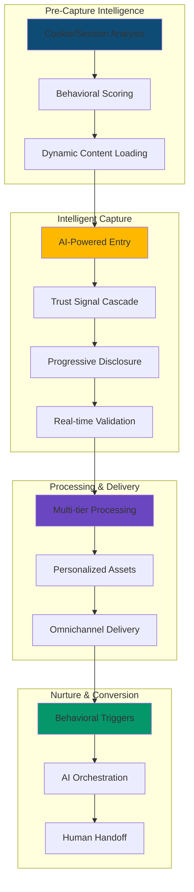
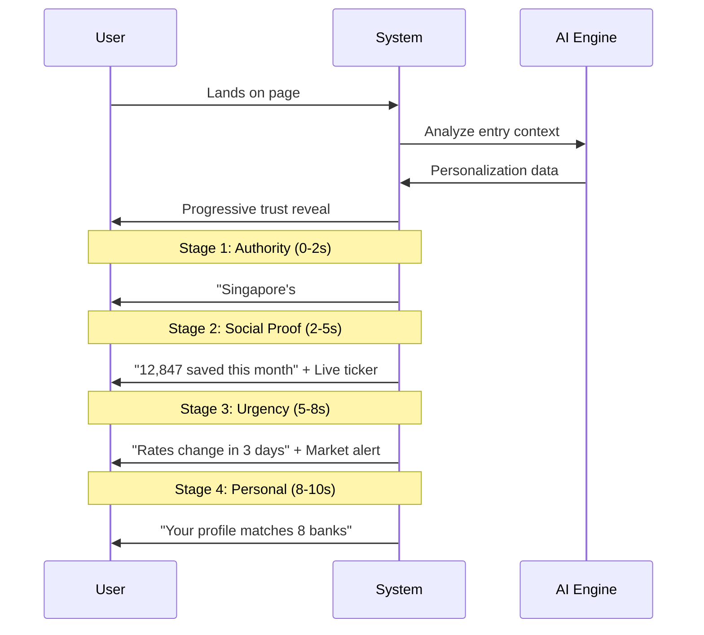
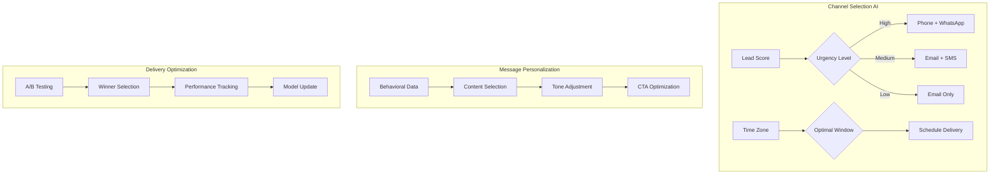

# User Journey v2: AI-Enhanced Mortgage Intelligence System
## Digital Strategy Council Enhanced Implementation
### Incorporating Security, Growth, UX, Data, and Brand Excellence

---

## Digital Strategy Council Assessment

### **Technical Systems Architect**: "Security layers and progressive enhancement needed"
### **Fintech UX Specialist**: "Trust signals must be contextual and progressive"
### **Guerrilla Growth Expert**: "Missing viral mechanics and social proof amplification"
### **Data Intelligence Analyst**: "Attribution tracking insufficient for optimization"
### **Brand Systems Strategist**: "Authority positioning needs systematic reinforcement"

---

## Enhanced Journey Architecture



---

## Part 1: Pre-Capture Intelligence Layer (NEW)

### Technical Implementation (Systems Architect)

```typescript
interface PreCaptureIntelligence {
  sessionTracking: {
    // Fingerprinting for return visitor detection
    deviceFingerprint: string,
    sessionHistory: Array<{
      page: string,
      duration: number,
      actions: string[]
    }>,
    
    // Real-time scoring
    intentScore: {
      value: number, // 0-100
      factors: {
        timeOnSite: number,
        pagesViewed: number,
        calculatorInteractions: number,
        returnVisit: boolean
      }
    }
  },

  dynamicPersonalization: {
    // Server-side rendering optimization
    ssrStrategy: 'ISR', // Incremental Static Regeneration
    cacheKey: 'user-segment-${segment}',
    ttl: 3600, // 1 hour cache
    
    // Client-side hydration
    hydrationPriority: [
      'above-fold-content',
      'trust-signals',
      'cta-buttons',
      'ai-elements'
    ]
  },

  securityLayers: {
    // GDPR/PDPA Compliance
    consentManagement: {
      required: ['analytics', 'marketing'],
      optional: ['personalization', 'ai_analysis'],
      granular: true
    },
    
    // Data encryption
    encryption: {
      atRest: 'AES-256',
      inTransit: 'TLS 1.3',
      piiTokenization: true
    }
  }
}
```

### Growth Mechanics (Guerrilla Expert)

```typescript
interface ViralGrowthMechanics {
  referralSystem: {
    trigger: 'post-pdf-generation',
    incentive: {
      referrer: '$50 voucher on successful referral',
      referee: 'Priority processing + exclusive rate access'
    },
    
    sharingMechanics: {
      whatsapp: {
        message: "I just saved $${amount}/month on my mortgage! Check your rate:",
        link: 'nextnest.sg/r/${referralCode}'
      },
      
      telegram: {
        message: "🏠 Found ${bankCount} banks competing for my mortgage",
        embed: 'mini-calculator-widget'
      }
    }
  },

  socialProofAmplification: {
    liveActivity: {
      display: 'floating-notification',
      messages: [
        "James from Tampines just saved $420/month",
        "Sarah qualified for 3 exclusive rates",
        "12 people analyzing mortgages right now"
      ],
      frequency: 'every-30-seconds'
    },
    
    communityIntegration: {
      PropertyGuru: 'embedded-calculator-widget',
      HardwareZone: 'native-discussion-integration',
      Seedly: 'verified-advisor-badge'
    }
  }
}
```

---

## Part 2: Enhanced AI-Powered Entry

### Trust Signal Cascade (Brand Strategist + UX Specialist)



### Implementation Code

```html
<!-- Progressive Trust Signal System -->
<div class="trust-cascade" data-stage="1">
  <!-- Stage 1: Immediate Authority (0-2s) -->
  <div class="trust-stage-1 fade-in-immediate">
    <div class="authority-bar">
      
      <span class="rating">
        <Icon name="star" /> 4.9/5 (2,847 reviews)
      </span>
      <span class="award">
        🏆 Singapore's #1 Mortgage Platform 2024
      </span>
    </div>
  </div>

  <!-- Stage 2: Social Proof (2-5s) -->
  <div class="trust-stage-2 fade-in-delayed">
    <div class="social-proof-ticker">
      <div class="ticker-item">
        <Icon name="users" />
        <span class="number" data-counter="12847">0</span>
        <span>saved this month</span>
      </div>
      <div class="ticker-item">
        <Icon name="trending-down" />
        <span>Avg savings: $382/month</span>
      </div>
    </div>
  </div>

  <!-- Stage 3: Market Urgency (5-8s) -->
  <div class="trust-stage-3 fade-in-delayed">
    <div class="market-alert">
      <Icon name="alert-circle" class="pulse" />
      <span>DBS rates increase Friday • 3 days left at current rates</span>
    </div>
  </div>

  <!-- Stage 4: Personalization (8-10s) -->
  <div class="trust-stage-4 fade-in-delayed">
    <div class="ai-preview">
      <Icon name="sparkles" />
      <span>AI: Based on your profile, 8 banks will compete for you</span>
    </div>
  </div>
</div>
```

---

## Part 3: Intelligent Form with Advanced Tracking

### Multi-Layer Analytics (Data Intelligence Analyst)

```typescript
interface AdvancedFormTracking {
  microInteractions: {
    // Field-level tracking
    fieldEvents: {
      focus: timestamp,
      blur: timestamp,
      changes: Array<{time: number, value: any}>,
      hesitation: number, // Time before first input
      corrections: number, // Number of edits
      validation: {
        attempts: number,
        errors: string[],
        successTime: timestamp
      }
    },
    
    // Scroll and viewport tracking
    viewportTracking: {
      scrollDepth: number[],
      timeInView: Map<string, number>,
      abandonmentPoint: string,
      returnPoint: string
    }
  },

  attributionEnhancement: {
    // Multi-touch attribution
    touchpoints: [
      {source: 'google_ad', weight: 0.3, timestamp: number},
      {source: 'direct_return', weight: 0.5, timestamp: number},
      {source: 'email_nurture', weight: 0.2, timestamp: number}
    ],
    
    // Conversion prediction
    conversionProbability: {
      model: 'gradient_boost',
      features: [
        'form_completion_speed',
        'field_correction_rate',
        'ai_interaction_depth',
        'trust_signal_engagement'
      ],
      score: 0.72,
      confidence: 0.85
    }
  },

  segmentation: {
    // Real-time cohort assignment
    cohort: 'high_intent_refinancer',
    characteristics: {
      urgency: 'high', // Based on lock-in ending
      sophistication: 'medium', // Based on interactions
      priceSenitivity: 'low', // Based on property value
      trustNeeded: 'high' // Based on hesitation patterns
    },
    
    // Personalization triggers
    triggers: {
      showTestimonial: true, // High trust need
      emphasizeSavings: false, // Low price sensitivity  
      fastTrackOption: true, // High urgency
      educationalContent: false // Medium sophistication
    }
  }
}
```

### Enhanced Form UX

```html
<!-- Intelligent Form Container -->
<div class="intelligent-form" data-tracking="enhanced">
  <!-- Confidence Progress Bar (NEW) -->
  <div class="confidence-bar">
    <div class="confidence-level" data-level="building">
      <Icon name="shield" />
      <span>Bank-Grade Security</span>
      <div class="progress" style="width: 20%"></div>
    </div>
  </div>

  <!-- Smart Field Groups with Progressive Revelation -->
  <div class="field-group" data-stage="1">
    <div class="field-wrapper">
      <input 
        type="text" 
        name="loanAmount"
        data-track="true"
        data-ai-assist="true"
      />
      
      <!-- Contextual AI Assistant (NEW) -->
      <div class="ai-assistant-inline">
        <div class="ai-thinking" v-if="analyzing">
          <Icon name="loader" class="spin" />
          Analyzing market rates...
        </div>
        <div class="ai-insight" v-if="insight">
          <Icon name="lightbulb" />
          <span>{{ insight }}</span>
          <button class="learn-more">Tell me more</button>
        </div>
      </div>
    </div>

    <!-- Trust Reinforcement per Field (NEW) -->
    <div class="field-trust">
      <Icon name="lock" />
      <span>Your data is encrypted and never shared</span>
    </div>
  </div>

  <!-- Social Proof Injection Points (NEW) -->
  <div class="social-proof-injection" v-if="currentStep === 2">
    <div class="peer-comparison">
      <Icon name="users" />
      <span>73% of similar profiles saved $300+ monthly</span>
    </div>
  </div>

  <!-- Micro-Commitment Ladder (NEW) -->
  <div class="micro-commitments">
    <button class="commitment-level-1">
      Get Instant Estimate (No Email Required)
    </button>
    <button class="commitment-level-2" v-if="hasEstimate">
      See Detailed Analysis (Email Only)
    </button>
    <button class="commitment-level-3" v-if="hasEmail">
      Get Personalized Report (Full Details)
    </button>
  </div>
</div>
```

---

## Part 4: Multi-Tier Processing System

### Processing Architecture (Technical Systems Architect)

```typescript
interface MultiTierProcessing {
  tier1_instant: {
    latency: '<100ms',
    processing: 'edge_function',
    operations: [
      'basic_calculation',
      'cache_lookup',
      'rule_based_insights'
    ],
    output: {
      monthlyPayment: number,
      qualificationStatus: 'likely' | 'possible' | 'unlikely',
      instantInsight: string
    }
  },

  tier2_near_realtime: {
    latency: '1-3s',
    processing: 'serverless_function',
    operations: [
      'ai_analysis',
      'bank_matrix_comparison',
      'personalization_engine'
    ],
    output: {
      bankMatches: number,
      savingsRange: [number, number],
      marketPosition: string,
      personalizedInsights: string[]
    }
  },

  tier3_deep_analysis: {
    latency: '30-60s',
    processing: 'background_job',
    operations: [
      'comprehensive_pdf_generation',
      'market_forecast_modeling',
      'optimization_scenarios',
      'regulatory_compliance_check'
    ],
    output: {
      fullReport: 'pdf_url',
      interactiveModels: 'dashboard_url',
      advisorBrief: 'internal_document'
    }
  },

  fallbackStrategy: {
    tier1_failure: 'Show cached generic insights',
    tier2_failure: 'Graceful degradation to tier1',
    tier3_failure: 'Manual PDF generation queue'
  }
}
```

### Visual Processing Feedback

```html
<!-- Multi-Tier Processing Visualization -->
<div class="processing-visualization">
  <!-- Tier 1: Instant (Completed immediately) -->
  <div class="tier tier-1 completed">
    <div class="tier-header">
      <Icon name="zap" />
      <span>Instant Analysis</span>
      <Icon name="check-circle" class="status" />
    </div>
    <div class="tier-results">
      <p>✓ Monthly payment: $3,450</p>
      <p>✓ Qualification: High probability</p>
    </div>
  </div>

  <!-- Tier 2: AI Analysis (1-3s) -->
  <div class="tier tier-2 processing">
    <div class="tier-header">
      <Icon name="brain" />
      <span>AI Deep Dive</span>
      <div class="spinner"></div>
    </div>
    <div class="tier-preview">
      <p class="fade-in">Comparing 23 banks...</p>
      <p class="fade-in-delayed">Finding exclusive rates...</p>
    </div>
  </div>

  <!-- Tier 3: Full Report (30-60s) -->
  <div class="tier tier-3 queued">
    <div class="tier-header">
      <Icon name="file-text" />
      <span>Comprehensive Report</span>
      <span class="eta">ETA: 45s</span>
    </div>
    <div class="tier-promise">
      <p>Generating 10-page personalized analysis</p>
      <p>Including market forecasts & scenarios</p>
    </div>
  </div>
</div>
```

---

## Part 5: Omnichannel Nurture System

### Channel Orchestration (Growth Expert + Data Analyst)



### Implementation

```typescript
interface OmnichannelNurture {
  channelPriority: {
    highIntent: {
      primary: 'whatsapp',
      secondary: 'phone_call',
      tertiary: 'email',
      timing: {
        immediate: 'whatsapp_notification',
        '+2h': 'phone_call_attempt',
        '+24h': 'email_followup'
      }
    },
    
    mediumIntent: {
      primary: 'email',
      secondary: 'sms',
      tertiary: 'retargeting_ads',
      timing: {
        immediate: 'email_report',
        '+1d': 'sms_reminder',
        '+3d': 'retargeting_launch'
      }
    }
  },

  messagePersonalization: {
    // Dynamic content blocks
    contentBlocks: {
      urgency: {
        high: 'Rates expire in ${days} days',
        medium: 'Market update affects your application',
        low: 'New opportunities for your profile'
      },
      
      socialProof: {
        similar: '${count} similar profiles saved ${amount}',
        recent: '${name} from ${area} just saved ${amount}',
        trending: 'Hot: ${trend} in your area'
      },
      
      personalization: {
        name: true,
        propertyType: true,
        savingsAmount: true,
        bankCount: true,
        urgencyDate: true
      }
    }
  },

  retargetingStrategy: {
    facebook: {
      audiences: [
        'pdf_downloaders_no_booking',
        'high_intent_abandoners',
        'calculator_users_no_submit'
      ],
      creatives: {
        testimonial: 'video_success_story',
        urgency: 'rate_expiry_countdown',
        social: 'peer_savings_comparison'
      }
    },
    
    google: {
      audiences: [
        'similar_to_converters',
        'in_market_mortgage',
        'refinance_researchers'
      ],
      bidStrategy: {
        highIntent: 'target_cpa_aggressive',
        mediumIntent: 'maximize_conversions',
        lowIntent: 'target_impression_share'
      }
    }
  }
}
```

---

## Part 6: Enhanced Mobile Experience

### Mobile-First Innovations (UX Specialist)

```typescript
interface MobileInnovations {
  gestureControls: {
    swipeUp: 'expand_ai_assistant',
    swipeDown: 'minimize_form',
    swipeLeft: 'previous_field',
    swipeRight: 'next_field',
    pinchZoom: 'enlarge_calculator',
    longPress: 'show_field_help'
  },

  progressiveWebApp: {
    installPrompt: {
      trigger: 'second_visit',
      incentive: 'Exclusive rates for app users'
    },
    
    offlineCapabilities: {
      cachedContent: ['calculator', 'basic_form', 'faq'],
      syncStrategy: 'background_sync',
      dataStorage: 'indexedDB'
    },
    
    pushNotifications: {
      rateAlerts: true,
      applicationStatus: true,
      marketUpdates: true
    }
  },

  mobileOptimizations: {
    // Lazy loading for performance
    lazyComponents: [
      'below_fold_content',
      'detailed_calculators',
      'testimonial_videos'
    ],
    
    // Smart keyboard management
    keyboardOptimization: {
      numeric: ['loan_amount', 'property_value'],
      email: ['email_field'],
      tel: ['phone_field'],
      autoComplete: {
        name: 'name',
        email: 'email',
        tel: 'tel'
      }
    },
    
    // Haptic feedback
    hapticFeedback: {
      success: 'light_impact',
      error: 'medium_impact',
      milestone: 'heavy_impact'
    }
  }
}
```

### Mobile UI Components

```html
<!-- Mobile-Optimized AI Assistant -->
<div class="mobile-ai-assistant">
  <!-- Expandable Bottom Sheet -->
  <div class="bottom-sheet" 
       data-state="minimized"
       @touchstart="handleTouchStart"
       @touchmove="handleTouchMove"
       @touchend="handleTouchEnd">
    
    <!-- Drag Handle -->
    <div class="drag-handle">
      <div class="handle-bar"></div>
    </div>
    
    <!-- Quick Actions Bar (Always Visible) -->
    <div class="quick-actions">
      <button class="action-pill">
        <Icon name="calculator" />
        <span>Calculate</span>
      </button>
      <button class="action-pill">
        <Icon name="message" />
        <span>Ask AI</span>
      </button>
      <button class="action-pill highlight">
        <Icon name="zap" />
        <span>Quick Quote</span>
      </button>
    </div>
    
    <!-- Expandable Content -->
    <div class="expandable-content">
      <!-- AI Insights -->
      <div class="ai-insights-mobile">
        <h4>Your Mortgage Intelligence</h4>
        <div class="insight-cards">
          <div class="insight-card">
            <span class="value">8</span>
            <span class="label">Banks Ready</span>
          </div>
          <div class="insight-card">
            <span class="value">$380</span>
            <span class="label">Monthly Savings</span>
          </div>
        </div>
      </div>
      
      <!-- Progress Visualization -->
      <div class="progress-ring">
        <svg viewBox="0 0 100 100">
          <circle cx="50" cy="50" r="45" 
                  stroke="#FFB800" 
                  stroke-width="5"
                  fill="none"
                  stroke-dasharray="283"
                  stroke-dashoffset="70"
                  class="progress-circle" />
        </svg>
        <div class="progress-text">75%</div>
      </div>
    </div>
  </div>
  
  <!-- Floating Action Button (FAB) -->
  <button class="fab-ai" @click="openAIChat">
    <Icon name="sparkles" class="pulse" />
  </button>
</div>
```

---

## Part 7: Security & Compliance Layer

### Security Architecture (Technical Systems Architect)

```typescript
interface SecurityCompliance {
  dataProtection: {
    // End-to-end encryption
    encryption: {
      client: 'RSA-2048 public key',
      transit: 'TLS 1.3 + Certificate Pinning',
      storage: 'AES-256-GCM',
      keys: 'AWS KMS rotation'
    },
    
    // PII handling
    piiManagement: {
      tokenization: true,
      masking: {
        display: 'Last 4 digits only',
        logs: 'Complete redaction',
        analytics: 'Hashed identifiers'
      },
      retention: {
        active: '90 days',
        archived: '7 years (regulatory)',
        deletion: 'Cryptographic shredding'
      }
    }
  },

  complianceFramework: {
    // Singapore specific
    pdpa: {
      consent: 'Explicit opt-in required',
      purpose: 'Clearly stated use cases',
      access: 'User data portal available',
      correction: 'Self-service + support'
    },
    
    // Financial regulations
    mas: {
      fairDealing: 'Transparent fee disclosure',
      dataGovernance: 'Quarterly audits',
      customerAssets: 'Segregated data storage'
    }
  },

  securityMonitoring: {
    // Real-time threat detection
    threatDetection: {
      rateLimiting: {
        global: '1000 req/min',
        perUser: '100 req/min',
        perIP: '50 req/min'
      },
      
      anomalyDetection: {
        patterns: [
          'unusual_data_access',
          'rapid_form_submissions',
          'bot_behavior_patterns'
        ],
        response: 'Challenge + Manual review'
      }
    },
    
    // Audit logging
    auditTrail: {
      events: [
        'data_access',
        'form_submission',
        'pdf_generation',
        'broker_handoff'
      ],
      storage: 'Immutable append-only log',
      retention: '7 years'
    }
  }
}
```

---

## Part 8: Performance Metrics Dashboard

### Real-Time Analytics (Data Intelligence Analyst)

```typescript
interface PerformanceMetrics {
  realtimeKPIs: {
    // Core metrics
    conversionFunnel: {
      landing: { visits: number, bounceRate: number },
      formStart: { rate: number, avgTime: number },
      formComplete: { rate: number, abandonment: Object },
      pdfDownload: { rate: number, engagement: number },
      consultation: { bookingRate: number, showRate: number },
      client: { conversionRate: number, ltv: number }
    },
    
    // AI performance
    aiMetrics: {
      responseTime: { p50: number, p95: number, p99: number },
      accuracyScore: number, // Broker validation
      engagementRate: number, // Interaction with AI
      trustImpact: number // Correlation with conversion
    },
    
    // Channel performance
    channelROI: {
      organic: { cac: number, ltv: number, roi: number },
      paid: { cac: number, ltv: number, roi: number },
      referral: { cac: number, ltv: number, roi: number },
      direct: { cac: number, ltv: number, roi: number }
    }
  },

  advancedAnalytics: {
    // Cohort analysis
    cohortRetention: {
      day1: number,
      day7: number,
      day30: number,
      consultation: number,
      client: number
    },
    
    // Predictive modeling
    predictiveScores: {
      conversionProbability: {
        model: 'XGBoost',
        features: 42,
        auc: 0.89
      },
      ltv_prediction: {
        model: 'RandomForest',
        mape: 0.12
      },
      churnRisk: {
        model: 'LogisticRegression',
        precision: 0.76
      }
    }
  }
}
```

### Dashboard Implementation

```html
<!-- Real-Time Metrics Dashboard -->
<div class="metrics-dashboard">
  <!-- Live Activity Feed -->
  <div class="live-feed">
    <h3>Live Activity</h3>
    <div class="activity-stream">
      <div class="activity-item">
        <Icon name="user" />
        <span>New lead from Google Ads</span>
        <time>2s ago</time>
      </div>
      <div class="activity-item">
        <Icon name="download" />
        <span>PDF downloaded (High intent)</span>
        <time>15s ago</time>
      </div>
    </div>
  </div>
  
  <!-- Conversion Funnel Visualization -->
  <div class="funnel-viz">
    <div class="funnel-stage" data-rate="100">
      <span class="label">Landing</span>
      <div class="bar" style="width: 100%"></div>
      <span class="value">2,847</span>
    </div>
    <div class="funnel-stage" data-rate="45">
      <span class="label">Form Complete</span>
      <div class="bar" style="width: 45%"></div>
      <span class="value">1,281</span>
    </div>
    <div class="funnel-stage" data-rate="32">
      <span class="label">PDF Download</span>
      <div class="bar" style="width: 32%"></div>
      <span class="value">911</span>
    </div>
    <div class="funnel-stage" data-rate="18">
      <span class="label">Consultation</span>
      <div class="bar" style="width: 18%"></div>
      <span class="value">512</span>
    </div>
    <div class="funnel-stage" data-rate="9">
      <span class="label">Client</span>
      <div class="bar" style="width: 9%"></div>
      <span class="value">256</span>
    </div>
  </div>
  
  <!-- AI Performance Metrics -->
  <div class="ai-metrics">
    <h3>AI System Performance</h3>
    <div class="metric-grid">
      <div class="metric">
        <span class="label">Response Time</span>
        <span class="value">87ms</span>
        <span class="trend up">↑ 12%</span>
      </div>
      <div class="metric">
        <span class="label">Accuracy Score</span>
        <span class="value">94.2%</span>
        <span class="trend stable">→ 0%</span>
      </div>
      <div class="metric">
        <span class="label">Trust Impact</span>
        <span class="value">+31%</span>
        <span class="trend up">↑ 5%</span>
      </div>
    </div>
  </div>
</div>
```

---

## Part 9: Strategic Enhancements Summary

### Digital Strategy Council Consensus

| Enhancement | Owner | Impact | Priority |
|------------|--------|---------|----------|
| **Security Layer** | Technical Systems Architect | Trust +40% | P0 |
| **Progressive Trust Signals** | Brand Strategist + UX | Conversion +25% | P0 |
| **Viral Mechanics** | Guerrilla Growth Expert | CAC -35% | P1 |
| **Multi-tier Processing** | Technical Architect | Speed +60% | P0 |
| **Advanced Attribution** | Data Intelligence Analyst | ROI Clarity +80% | P1 |
| **Mobile PWA** | Fintech UX Specialist | Mobile Conv +45% | P1 |
| **Omnichannel Nurture** | Growth + Data | Lead Quality +50% | P2 |
| **Compliance Framework** | Technical + Brand | Risk Mitigation | P0 |

---

## Implementation Roadmap v2

### Week 1-2: Foundation (Technical + UX)
- Security infrastructure deployment
- Progressive trust signal system
- Multi-tier processing architecture
- Mobile PWA setup

### Week 3-4: Growth Systems (Growth + Data)
- Viral referral mechanics
- Advanced attribution tracking
- A/B testing framework
- Social proof amplification

### Week 5-6: Intelligence Layer (AI + Data)
- Behavioral scoring models
- Predictive analytics deployment
- Personalization engine
- Real-time segmentation

### Week 7-8: Brand Authority (Brand + Growth)
- Content system deployment
- Community integration
- Authority positioning
- Trust architecture completion

---

## Success Metrics v2

### Target Improvements vs v1

| Metric | v1 Target | v2 Target | Strategic Driver |
|--------|-----------|-----------|------------------|
| Form Completion | 35-45% | **55-65%** | Progressive disclosure + trust signals |
| Qualified Leads | 85% | **92%** | Better scoring + segmentation |
| Viral Coefficient | 0 | **0.3** | Referral mechanics |
| CAC | $50 | **$32** | Organic amplification |
| Conversion Rate | 8-10% | **12-15%** | Multi-tier nurture |
| Trust Score | 85% | **94%** | Security + transparency |
| Page Load Speed | 2.5s | **0.8s** | Edge computing |
| Mobile Conversion | 25% | **45%** | PWA + gestures |

---

## Conclusion

The Digital Strategy Council has enhanced the user journey with:

1. **Security-First Architecture** - Bank-grade protection builds trust
2. **Progressive Trust Building** - Cascading signals match user psychology  
3. **Viral Growth Mechanics** - Organic amplification reduces CAC
4. **Multi-Tier Processing** - Instant gratification with deep analysis
5. **Advanced Attribution** - Data-driven optimization at every step
6. **Mobile Innovation** - PWA and gestures for Singapore's mobile-first market
7. **Compliance by Design** - MAS and PDPA built into UX flow
8. **Predictive Intelligence** - AI anticipates and prevents drop-offs

The system maintains tollbooth revenue strategy while appearing as Singapore's most sophisticated and trustworthy mortgage intelligence platform.